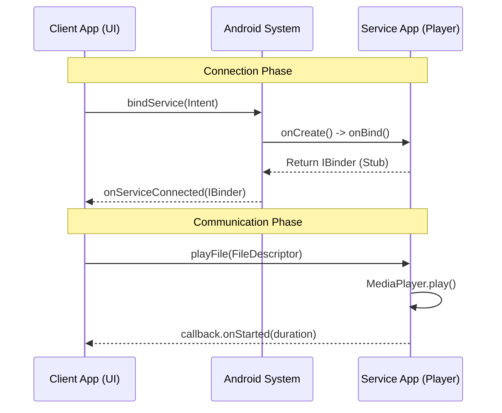
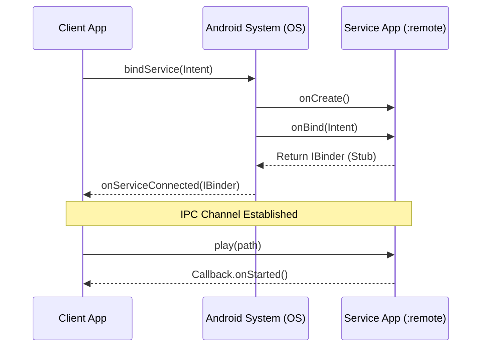

# Android AIDL Audio Player Sample 🎵

A robust Android project demonstrating **Inter-Process Communication (IPC)** using **AIDL**.
Ideally designed for **Interview Preparation** (Fresher to Senior levels).

---

## 🚀 Getting Started (Fresher Level)
Follow these steps to run the project from scratch.

### 1. Prerequisites
- Android Studio (Koala or newer recommended).
- JDK 17 or higher.
- Android SDK Platform 34.

### 2. Build & Install
Since this project has two apps (Service & Client), you must install both.

**Option A: Using Command Line (Fastest)**
Open the terminal in the project root:
```bash
# 1. Build everything
./gradlew assembleDebug

# 2. Install the Service App (Back-end provider)
adb install -r service-app/build/outputs/apk/debug/service-app-debug.apk

# 3. Install the Client App (Front-end UI)
adb install -r client-app/build/outputs/apk/debug/client-app-debug.apk
```

**Option B: Using Android Studio**
1. Select `service-app` from the run configuration dropdown and press **Run**.
2. Select `client-app` from the run configuration dropdown and press **Run**.

### 3. Usage
1. Open **"AidlPlayerClient"** from your launcher.
2. Tap **CONNECT**. You should see "Connected to Service".
3. Tap **PICK AUDIO FILE**. Select any mp3 song from your phone.
4. The song will start playing via the Service process!

---

## 🧠 Core Concepts (Intermediate)

### What is AIDL?
**AIDL** (Android Interface Definition Language) allows two different apps (processes) to talk to each other.
- **Client**: The UI app you touch.
- **Service**: The background app playing the music.
- **Interface**: The contract (`IAudioPlayer.aidl`) defining what functions are available (`play`, `pause`, `stop`).

### Protocol Flow


---

## 💡 Pro Tips (Senior Developer)
Key architectural patterns used in this project.

### 1. Secure File Sharing (`ParcelFileDescriptor`)
**Problem**: The Service runs as a different user (UID). It cannot access files selected by the Client due to permission restrictions.
**Solution**:
- The Client opens the file (using `contentResolver.openFileDescriptor`).
- Pass the **Open File Descriptor** (`ParcelFileDescriptor`) to the Service.
- The Service plays it directly without needing any storage permissions.
- *Code*: See `playFile` in `AudioPlayerService.kt`.

### 2. Thread-Safe Callbacks (`RemoteCallbackList`)
**Problem**: AIDL is multi-threaded. Client callbacks can disappear if the client crashes.
**Solution**:
- Use `RemoteCallbackList<T>`.
- It automatically handles **Link-To-Death** (unregisters the callback if the client process dies).
- It provides thread-safe broadcasting.

### 3. Package Visibility (`<queries>`)
**Context**: On Android 11+ (SDK 30+), apps cannot see other installed packages by default.
**Fix**: We added the `<queries>` tag in `client-app/AndroidManifest.xml` to explicitly allow visibility of `com.example.aidlplayer.service`.

### 4. Handling Process Death
**Scenario**: If the Service crashes, the Client stays alive but broken.
**Pattern**:
- We use `ServiceConnection.onServiceDisconnected` to detect crashes.
- We also register a `linkToDeath` listener for immediate notification.
- The UI updates to "Service Disconnected" to inform the user.

---
**Happy Coding!** 🚀

A complete sample project demonstrating **IPC (Inter-Process Communication)** using **AIDL** for an Audio Player service running in a separate process. Designed for Senior Android Engineer interview preparation.

## Architecture

- **Service App (`:service-app`)**:
  - Runs in a separate process (`:remote`).
  - Hides `MediaPlayer` implementation specifics.
  - Exposes `IAudioPlayer.aidl` for commands.
  - Uses `RemoteCallbackList` to manage `IAudioPlayerCallback.aidl` for thread-safe event broadcasting.
  
- **Client App (`:client-app`)**:
  - Binds to the service using `bindService()`.
  - Implements `IAudioPlayerCallback.Stub` to receive async events.
  - Handles process death via `ServiceConnection.onBindingDied` or `linkToDeath`.

### Protocol Flow (Binding)



## How to Run

1. **Build Project**:
   ```bash
   ./gradlew assembleDebug
   ```
2. **Install Service**:
   ```bash
   adb install -r service-app/build/outputs/apk/debug/service-app-debug.apk
   ```
3. **Install Client**:
   ```bash
   adb install -r client-app/build/outputs/apk/debug/client-app-debug.apk
   ```
4. **Launch**: Open "AidlPlayerClient" on your emulator/device.
   - *Note*: Ensure you have a valid audio file path (e.g., `/sdcard/Music/test.mp3`) or modify the path in the UI text field. Grant permissions if prompted.

5. **Troubleshooting**:
   - If build fails with `AndroidX` errors, ensure `gradle.properties` (included) contains `android.useAndroidX=true`.
   - If `gradlew` is missing, open the project in Android Studio to generate it, or use your local `gradle` installation.

6. **Verify Build**:
   ```bash
   ./gradlew assembleDebug
   ```
   *Status: Verified passing on Windows/Latest AGP.*

## Interview Focus Topics

### 1. Why AIDL?
**Q: Why use AIDL instead of Messenger or BroadcastReceiver?**
- **Messenger**: Queue-based, single-threaded. Good for simple messages, but bad for complex, concurrent method calls or when you need a typed interface.
- **AIDL**: Allows multi-threaded concurrent requests. Defines a strict contract (Interface). Essential when you need to expose a complex API (play, pause, seek, getDuration) to other applications.

### 2. Threading Model
- **Client Side**: Calls to AIDL interfaces are synchronous (blocking) by default unless marked `oneway`. They should be called from background threads if they might take time.
- **Service Side**: AIDL calls arrive on a **Binder Thread Pool**, *not* the Main Thread.
  - **Requirement**: The service implementation (Stub) MUST be thread-safe. We used `synchronized` blocks in `AudioPlayerService` to protect the `MediaPlayer` instance.

### 3. One-way vs Two-way
- **Two-way (Default)**: Client waits for Service to finish the method and return a result.
- **One-way (`oneway`)**: Client sends the request and returns immediately. The function cannot return values or throw exceptions.
  - *Usage*: We used `oneway` for `IAudioPlayerCallback` because the service shouldn't block waiting for the client to handle a callback.

### 4. RemoteCallbackList
**Q: How do you safely handle callbacks across processes?**
- Use `RemoteCallbackList`. It handles:
  - **Thread Safety**: Internally synchronized.
  - **Death Handling**: Automatically unregisters callbacks if the hosting process (Client) dies.
  - **Broadcasting**: Simplifies the loop to notify all listeners.

### 5. Service Lifecycle & Process Death
- **Bound Service**: The service lives as long as a client is bound (or it was started).
- **Process Death**: If the Service process crashes, the Client receives `onServiceDisconnected`. The Client should handle reconnection logic.
- **LinkToDeath**: Clients can register a `DeathRecipient` on the IBinder to get immediate notification of service death.

### 6. Multiple AIDL Interfaces (Connectivity)
**Q: How do you handle multiple AIDL interfaces in one Service?**
- **Pattern**: The `onBind` method returns a specific Binder based on the `Intent` action.
- **Example**: `ConnectivityService` checks `intent.action`:
  - `BIND_WIFI` -> returns `IWifiManager.Stub`
  - `BIND_BLUETOOTH` -> returns `IBluetoothManager.Stub`
  - `BIND_CAR_CONTROL` -> returns `ICarControl.Stub`
- This keeps concerns separated (Interface Segregation) while running in a single service process.

## Code Structure
- **Core Audio**: `IAudioPlayer.aidl`, `AudioPlayerService.kt`
- **Connectivity**: 
  - `IWifiManager.aidl`, `IBluetoothManager.aidl`, `INfcManager.aidl`, `ICarControl.aidl`
  - `ConnectivityService.kt`: Handles all connectivity requests.
- **Client**: `MainActivity.kt` (Audio), `CarDashboardActivity.kt` (Vehicle Controls).

---

## Pro Tips for Senior Interviews 💡

### 1. Handling DeadObjectException
- **Scenario**: When the separate server process crashes, any call on the stored `IBinder` reference will throw `DeadObjectException` (a subclass of `RemoteException`).
- **Fix**: Always wrap AIDL calls in `try-catch(RemoteException)`.
- **Recovery**: Use `linkToDeath` to get notified immediately and trigger a re-bind logic.

### 2. TransactionTooLargeException
- **Limit**: The Binder transaction buffer is limited (1MB shared across all transactions in process).
- **Risk**: Sending large bitmaps or huge lists via AIDL will crash the app.
- **Solution**: Use `ContentProvider`, shared files, or `Ashmem` (via `MemoryFile` or `ParcelFileDescriptor`) for large data.

### 3. Security (Permission Checks)
- **Question**: How do you prevent malicious apps from binding to your service?
- **Answer**:
  1. **Manifest**: Add `android:permission="com.example.MY_PERMISSION"` to the `<service>` tag.
  2. **Code**: In `onBind()` or inside Stub methods, use:
     ```kotlin
     if (checkCallingOrSelfPermission("must.have.permission") != PackageManager.PERMISSION_GRANTED) {
         throw SecurityException("Not allowed");
     }
     ```
  3. **Package Check**: Verify `getCallingUid()` matches a trusted signature.

---
